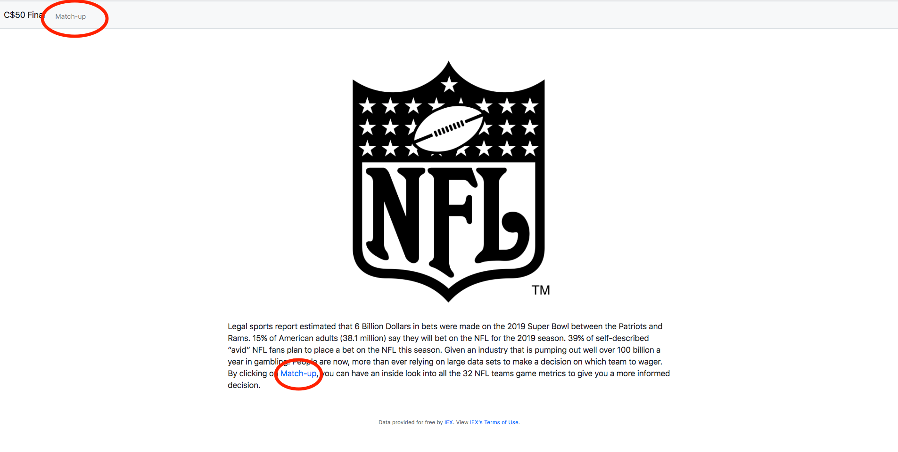
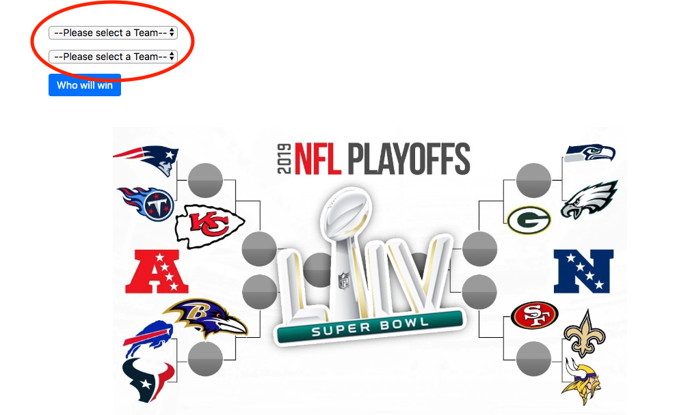
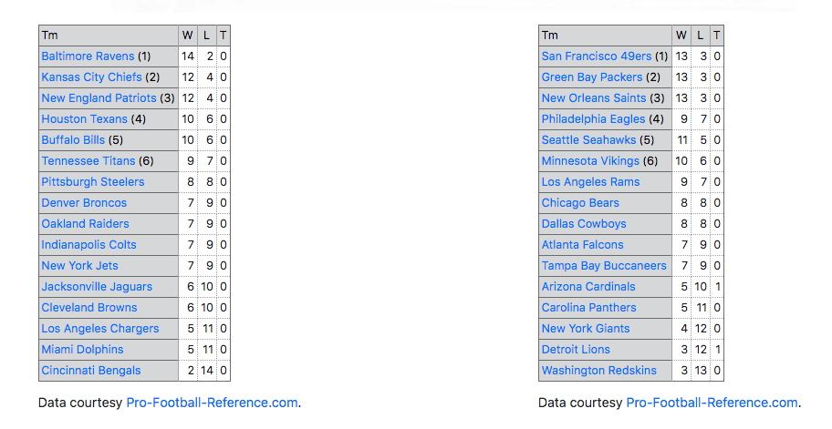
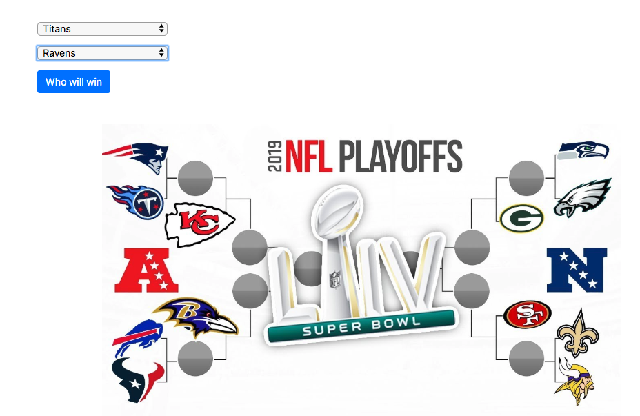
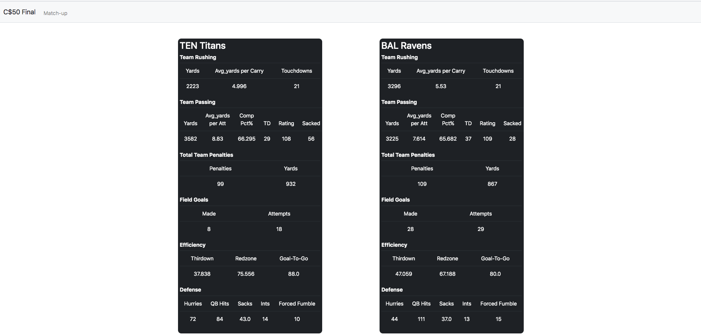
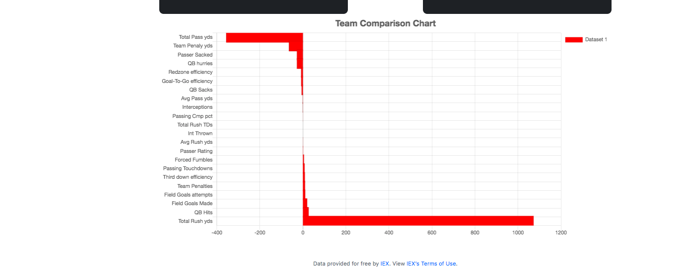

The following application is a project I am working on to tap into a relevant sports stastics API(SportRadar - https://sportradar.us/). Pull specific information and format as desired, then complete some basic manipulation of data to give users insight of particular NFL Team Statistics so they might make an informed decision on who they think will win the next game - this was done towards the end of the 2019 season and  2019 playoffs and shows full season stats for all teams in the league(Not Playoff stats).

The application uses Python, Flask, Javascript, Bootstrap, chart.js... etc.
You will need an API_Key for this application to work as the key is hidden via ENV variable

At the Home screen users will get some brief insight as to why people are so concerned with big data in sports, and can click **match-up** in the nav-bar or in the text.

User will then be promptet to input 2 teams to compare - Along with have a insight to team records through a profootball reference script

Once teams have been selected and the | **who will win** | button is clicked, stats will populate the page - giving users insight into specific stats for teams and a horizontal bar chart that shows the disparity between them. Note that the bar graph moves in the direction of corresponding team placed above it.

